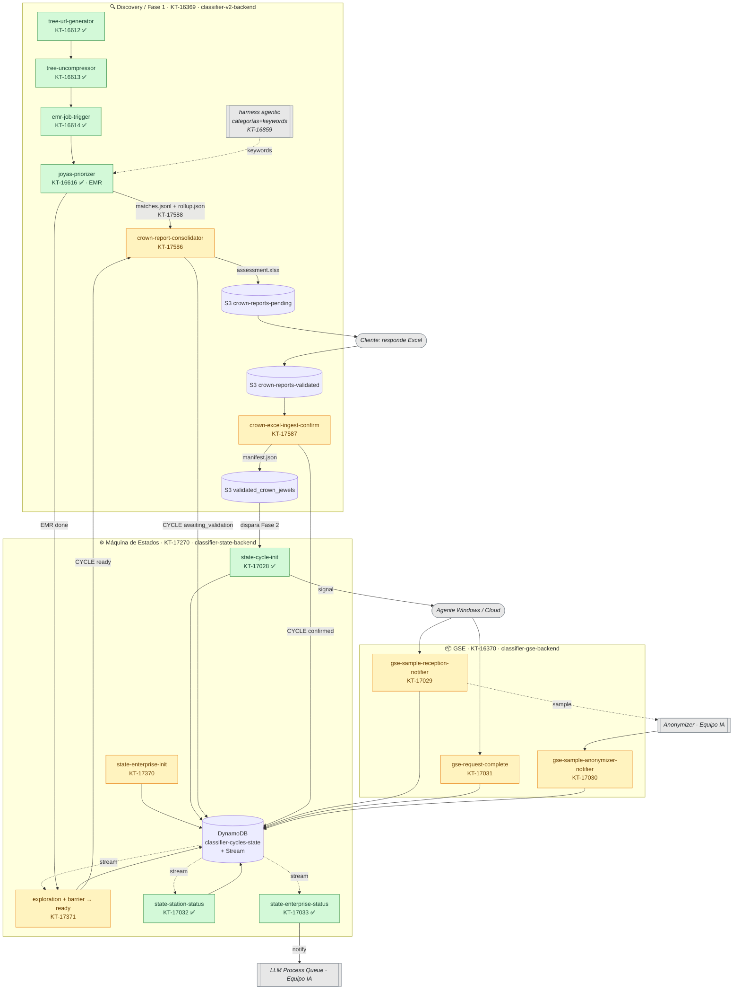

# Estado Actual — Backend Classifier v2

> **Última actualización:** 2026-06-24 (sync con Jira real + cierre de Fase 1 por Excel manual)
> **Source of truth** del estado del backend. Reemplaza la versión anterior (que usaba numeración de tickets ficticia).
> **Stack:** Python 3.11 · Lambda Container (ECR) · CloudFormation · pytest/ruff/mypy · uv.
>
> **Novedades 2026-06-24:** la Máquina de Estados (KT-17028/17032/17033 + monorepo KT-17271 + AppSync KT-17487) está **Done**. El cierre de Fase 1 pasó a ser **manual por Excel a nivel de categoría** (confirmado por KAIM-6315/6316), sin OpenSearch en el camino crítico. KT-17024/17026/17027 (modelo web por-archivo) descopeados/parkeados → BE 07.

---

## 1. Modelo: 3 épicas de backend (+ 1 futura)

Cada módulo = **una épica + un monorepo**. La infraestructura de cada lambda va **dentro de su ticket de implementación** (no hay tickets DevOps de infra suelta).

| # | Épica | Jira | Monorepo | Estado |
|---|---|---|---|---|
| 1 | **Discovery / Fase 1** (scan → match → Excel) | [KT-16369](https://kriptosteam.atlassian.net/browse/KT-16369) | `classifier-v2-backend` ([KT-17132](https://kriptosteam.atlassian.net/browse/KT-17132) ✅) | In Progress |
| 2 | **Máquina de Estados** (ciclos/estaciones) | [KT-17270](https://kriptosteam.atlassian.net/browse/KT-17270) | `classifier-state-backend` ([KT-17271](https://kriptosteam.atlassian.net/browse/KT-17271) ✅) | In Progress · núcleo Done |
| 3 | **GSE** (sample collection) | [KT-16370](https://kriptosteam.atlassian.net/browse/KT-16370) | `classifier-gse-backend` ([KT-17134](https://kriptosteam.atlassian.net/browse/KT-17134)) | To Do · RFC |
| 4 | **Validación web** (client-facing, AppSync) | _futura — BE 07_ | TBD | No creada (aloja KT-17026/17027) |

---

## 2. Diagrama end-to-end

**Lectura:** Discovery escanea y matchea (EMR). El **harness agentic** (KT-16859) sugiere categorías + keywords que alimentan el match. EMR emite `rollup.json` por estación (KT-17588). La **Máquina de Estados** lleva el CYCLE por `initialized → scanning → ready → awaiting_validation → confirmed`: el **barrier** (KT-17371) marca `ready` cuando todas las estaciones terminaron → dispara `crown-report-consolidator` (KT-17586) que genera **un Excel por enterprise** y lo deja en `crown-reports-pending`. El **cliente responde el Excel** → se deposita en `crown-reports-validated` → `crown-excel-ingest-confirm` (KT-17587) lo procesa, escribe `manifest.json` y **dispara Fase 2** (`state-cycle-init`). **GSE** recolecta/anonimiza; al cerrar, `state-enterprise-status` notifica al **LLM Process Queue**. **Sin OpenSearch en el camino crítico** (modelo web por-archivo diferido a BE 07).

---

## 3. Tickets por épica

### 🔍 Discovery / Fase 1 — KT-16369

| Ticket | Componente | Estado |
|---|---|---|
| KT-16612 | tree-url-generator | ✅ Done |
| KT-16613 | tree-uncompressor | ✅ Done |
| KT-16614 | emr-job-trigger | ✅ Done |
| KT-16616 | joyas-priorizer (EMR) | ✅ Done |
| KT-17132 | Monorepo `classifier-v2-backend` | ✅ Done |
| KT-17247 | JDC — inclusión de `area_id` en metadata | ✅ Done |
| KT-16859 | harness agentic — sugiere categorías+keywords (re-scope Fase 1) | 🔄 In Progress |
| **KT-17588** | **EMR `rollup.json` por estación** (add-on a KT-16616) | 🆕 RFC |
| **KT-17586** | **crown-report-consolidator** — Excel por enterprise (KAIM-6316) | 🆕 RFC |
| **KT-17587** | **crown-excel-ingest-confirm** — Excel validado → manifest → Fase 2 | 🆕 RFC |
| KT-17024 | crown-candidates-indexer (modelo web por-archivo) | ⛔ descopeado · recomendado cancelar |
| _parkeados (→ BE 07)_ | KT-17026 validation-handler · KT-17027 validation-confirm | 📋 RFC |

### ⚙️ Máquina de Estados — KT-17270

| Ticket | Componente | Estado |
|---|---|---|
| KT-17271 | Monorepo `classifier-state-backend` (aloja la DDB `classifier-cycles-state`) | ✅ Done |
| KT-17028 | **state-cycle-init** (crea CYCLE/STATION/REQUEST, multi-trigger) | ✅ Done |
| KT-17032 | **state-station-status** (cierre STATION) | ✅ Done |
| KT-17033 | **state-enterprise-status** (cierre CYCLE + notify LLM) | ✅ Done |
| KT-17487 | AppSync `CreateEvent` + `getAnalysisDocument` | ✅ Done |
| KT-17370 | **state-enterprise-init** (alta ENTERPRISE+CYCLE al iniciar exploración) | 📋 RFC |
| **KT-17371** | **exploration + barrier → CYCLE `ready`** (estados nuevos) | 📋 RFC |

> **Estados del CYCLE:** `initialized → scanning → ready → awaiting_validation → confirmed → (Fase 2)`; `phase2_skipped` si el cliente rechaza todo. `ready` lo setea KT-17371; `awaiting_validation` KT-17586; `confirmed`/`phase2_skipped` KT-17587.

### 📦 GSE — KT-16370

| Ticket | Componente | Estado |
|---|---|---|
| KT-17029 | gse-sample-reception-notifier (samples_received++) | 📋 RFC |
| KT-17030 | gse-sample-anonymizer-notifier (samples_anonymized++) | 📋 RFC |
| KT-17031 | gse-request-complete (status: sent) | 📋 RFC |
| KT-17134 | Monorepo `classifier-gse-backend` | 📋 RFC |

### 🟦 JDC (reunión 2026-06-02) — bajo KT-16369

| Ticket | Componente | Dueño |
|---|---|---|
| KAIM-6315 | Documento de casuísticas de cambios del cliente | Esteban Trujillo |
| KAIM-6316 | Formato estándar de Excel (tipo CESEM) | Esteban Trujillo |
| KT-17245 / KT-17246 | Seguimiento de los anteriores | Sofia Murillo |
| KT-17247 | Inclusión de `area_id` (ver Discovery) | Backend |

---

## 4. Modelo de infraestructura (decisión 2026-06-02)

- **Un monorepo por módulo** (CloudFormation + lambdas + pipeline).
- **La infra de cada lambda va dentro de su ticket de implementación** (su SQS, EventBridge rule/pipe, IAM, buckets). Ya **no** hay tickets DevOps de infra suelta.
- La **DDB `classifier-cycles-state`** (con Stream) es el store compartido — vive en el monorepo de Máquina de Estados; los demás módulos reciben grant IAM cross-stack.

**Tickets de infra suelta cancelados** (su contenido se absorbió en monorepos/implementaciones): KT-17009 (DDB→KT-17271), KT-17010 (OS index→KT-17024), KT-17017 (buckets GSE→KT-17134), KT-17011 y KT-17016 (ya estaban).

---

## 5. Limpieza realizada (2026-06-02)

- **Épica legacy KT-16370** (versión pre-refresh de GSE) → sus 12 hijos cancelados (KT-16617–16622 lambdas + KT-16730–16735 devops), superseded por KT-17028–17033. La épica se **reabrió** y reusa como la GSE vigente.
- **KT-17025** (phase1-enterprise-barrier) cancelado → pertenece a la futura épica de Validación; contexto preservado en `specs-staging/KT-17025-crown-enterprise-barrier.md`.
- Renombrados `gse-cycle-init/station-status/enterprise-status` → `state-*` (son maquinaria genérica de estados, no exclusiva de GSE).

---

## 6. Pendientes / gaps abiertos

| # | Pendiente | Owner |
|---|---|---|
| 1 | **Épica de Validación web (BE 07)** — crear y mover KT-17026/17027 (+ recrear KT-17025) | Producto + Backend |
| 2 | Gap **`signal-handler`** / **`url-generator`** (pre-signed URL Windows) — sin ticket | Equipo Agente / IA |
| 3 | Canales finales con Equipo IA: Signal Handler, Anonymizer, LLM Process Queue (hoy stubs) | Equipo IA |
| 4 | **Cancelar KT-17024** (sin alcance propio tras descope) | Backend |
| 5 | **OQ del Excel**: ¿emitimos `.xlsx` estilado o dataset para CO? · layout de la columna de decisión en el Excel respondido | Producto + CO |
| 6 | **Re-scope KT-16859**: spec del harness agentic (output de categorías+keywords) — owner IA | Equipo IA + Backend |

**Desbloqueado 2026-06-24:** insumos JDC de Esteban (KAIM-6316 **Done**, KAIM-6315 en **Review**) → el formato del Excel y las casuísticas ya están definidos; habilitan KT-17586/17587.

---

## 7. Diagrama

Ver [architecture.html](architecture.html) (render del diagrama de arriba). Los `.drawio` anteriores se eliminaron por estar desactualizados.
