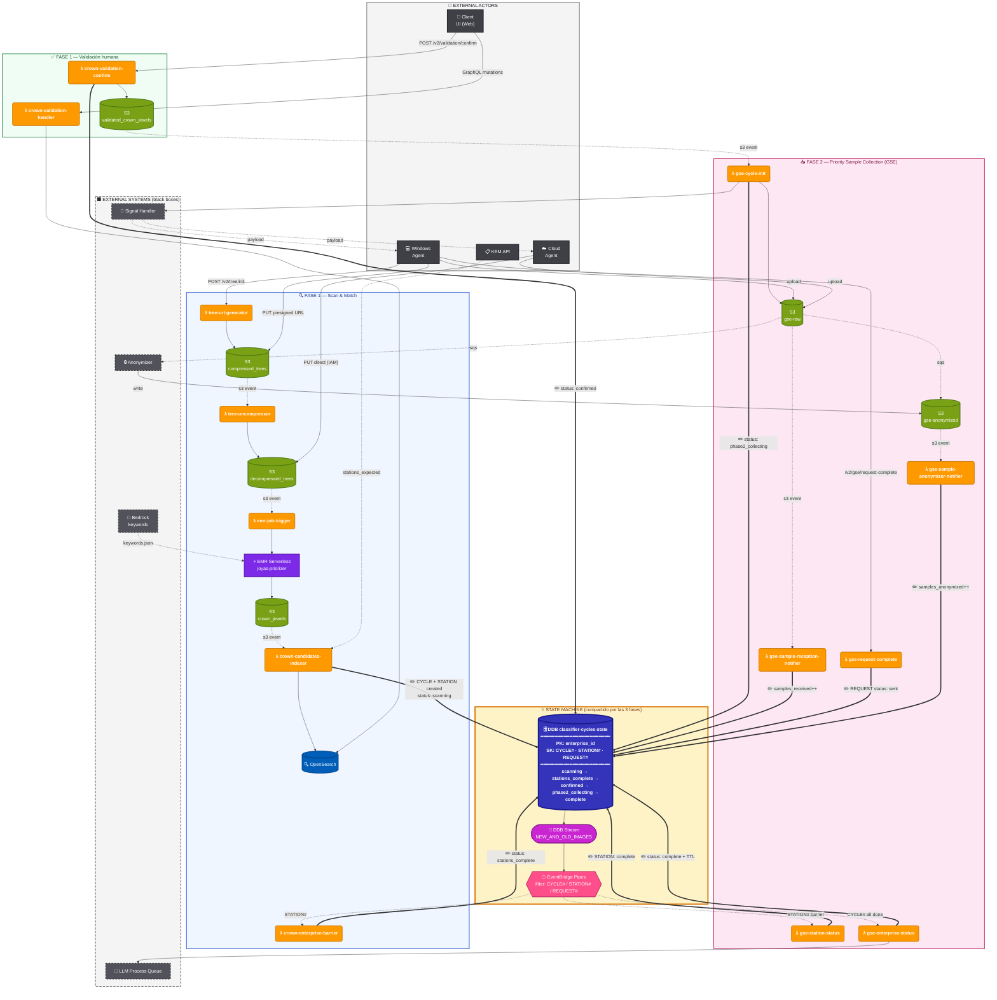

# Diagrama Global — Classifier Backend v2

Diagrama único que muestra **las 3 fases convergiendo al State Machine compartido** (DDB `classifier-cycles-state`).

---

## Cómo verlo

1. **Mermaid Live Editor** (recomendado): https://mermaid.live → pegar el código → exportar como SVG/PNG
2. **Miro**: Insert → Diagram → Mermaid → pegar el código
3. **VS Code**: instalar extensión "Markdown Preview Mermaid Support" → preview de este archivo
4. **GitHub/GitLab**: este archivo se renderiza automáticamente

---

## Vista global

---

## Convenciones visuales

| Elemento | Color | Significado |
|---|---|---|
| 🟧 Naranja | `#FF9900` | AWS Lambda |
| 🟩 Verde | `#7AA116` | S3 bucket |
| 🟦 Azul oscuro | `#3334B9` | **DynamoDB (State Machine)** |
| 🟪 Morado claro | `#C925D1` | DDB Stream |
| 🟥 Rosa | `#FF4F8B` | EventBridge Pipes |
| 🔵 Azul | `#005EB8` | OpenSearch |
| 🟣 Morado | `#7D2AE8` | EMR Serverless |
| ⬛ Gris oscuro | `#52525B` | Sistemas externos (black box) |
| ⬜ Gris claro | `#3F3F46` | Actores externos (agentes, cliente) |

### Tipos de flecha

| Flecha | Significado |
|---|---|
| `──→` línea sólida | Llamada síncrona / invocación directa |
| `╌╌→` línea punteada | Evento asíncrono (S3 event, DDB Stream, SQS) |
| `══→` doble línea | **Escritura al State Machine (DDB)** — visualmente destacado |

---

## Lectura del diagrama

1. **Top:** Actores externos disparan el flujo
2. **Centro (amarillo):** **State Machine compartido** — todas las fases leen/escriben aquí
3. **Izquierda:** Fase 1 Scan&Match (azul)
4. **Centro-izq:** Fase 1 Validación (verde)
5. **Derecha:** Fase 2 GSE (rosa)
6. **Bottom:** Sistemas externos (Signal Handler, Anonymizer, LLM, Bedrock)

**Lo importante:** las flechas dobles `══→` muestran que **TODAS las fases convergen en el DDB**. El State Machine es el único punto de verdad.

---

## Si querés iconos AWS oficiales

Mermaid no soporta iconos AWS nativos. Opciones:

1. **Renderizar a SVG** desde Mermaid Live Editor → editar en Figma/Miro y reemplazar nodos por iconos AWS oficiales
2. **Crear en draw.io** importando `architecture.drawio` (ya existe) y limpiándolo
3. **Crear directamente en Miro** copiando este flujo como referencia (los componentes AWS oficiales están en la librería de Miro)

---

## Variantes (si necesitás más detalle)

Si este diagrama es demasiado denso, puedo separarlo en:
- **STATE-MACHINE.md** — transiciones de estado (CYCLE → STATION → REQUEST)
- **F1-SCAN-MATCH.md** — solo Fase 1 con más detalle
- **F2-GSE.md** — solo Fase 2 con más detalle

Indicame qué prefieres.
