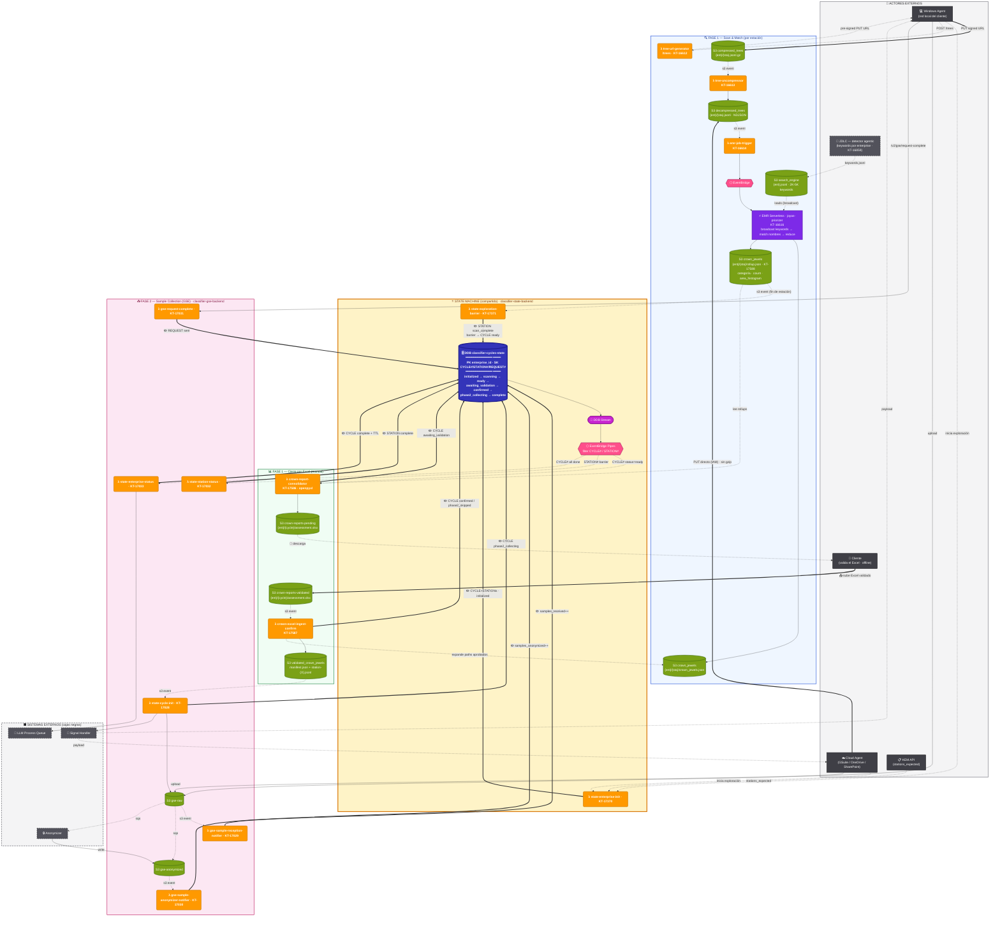

# Diagrama Global — Classifier Backend v2

> **Actualizado:** 2026-06-30 — cierre de Fase 1 por **Excel manual** (sin front): barrier de enterprise → consolidador → validación offline del cliente → ingest-confirm → Fase 2. OpenSearch y la validación web (KT-17026/17027) quedan **diferidos** a la épica de Validación (BE 07).

Diagrama único que muestra **las dos fases convergiendo al State Machine compartido** (DDB `classifier-cycles-state`). La base de Fase 1 (árbol por estación) es el flujo real de scan & match: agentes → árboles → EMR → joyas por estación.

---

## Cómo verlo

1. **Mermaid Live Editor**: https://mermaid.live → pegar → exportar SVG/PNG
2. **VS Code**: extensión "Markdown Preview Mermaid Support" → preview de este archivo
3. **GitHub/GitLab**: se renderiza automáticamente

---

## Vista global

---

## Convenciones visuales

| Color | Significado |
|---|---|
| 🟧 Naranja `#FF9900` | AWS Lambda |
| 🟩 Verde `#7AA116` | S3 bucket |
| 🟦 Azul oscuro `#3334B9` | **DynamoDB (State Machine)** |
| 🟪 Morado `#C925D1` | DDB Stream |
| 🟥 Rosa `#FF4F8B` | EventBridge / Pipes |
| 🟣 Morado `#7D2AE8` | EMR Serverless |
| ⬛ Gris oscuro `#52525B` | Sistemas externos / detector agentic (caja negra) |
| ⬜ Gris claro `#3F3F46` | Actores externos (agentes, cliente, KEM) |

### Tipos de flecha

| Flecha | Significado |
|---|---|
| `──→` sólida | Llamada síncrona / invocación directa |
| `╌╌→` punteada | Evento asíncrono (S3 event, DDB Stream, SQS) |
| `══→` doble | **Escritura al State Machine (DDB)** o PUT clave del flujo — destacado |

---

## Lectura del diagrama

1. **Arriba:** actores (Windows/Cloud Agent, Cliente, KEM) y el detector agentic JDLC.
2. **Fase 1 Scan & Match (azul):** el árbol por estación — agentes → `compressed/decompressed_trees` → EMR `joyas-priorizer` (con keywords de JDLC) → `crown_jewels.json` **+ `rollup.json`** por estación.
3. **Centro (amarillo):** **State Machine**. `state-enterprise-init` da de alta el CYCLE; `state-exploration-barrier` marca cada STATION `scan_complete` y, cuando están todas, `CYCLE → ready`.
4. **Fase 1 Cierre por Excel (verde):** `ready` dispara `crown-report-consolidator` → **un Excel por enterprise** (suma de `rollup.json`, formato KAIM-6316) → `awaiting_validation`. El cliente lo valida **offline** y lo sube → `crown-excel-ingest-confirm` materializa `manifest.json` → `confirmed`.
5. **Fase 2 GSE (rosa):** el `manifest.json` dispara `state-cycle-init` y arranca el muestreo.
6. **Abajo:** sistemas externos (Signal Handler, Anonymizer, LLM Process Queue).

**Lo importante:** las flechas dobles `══→` muestran que **todas las fases convergen en el DDB**. El cierre de Fase 1 ya **no usa front ni OpenSearch**: es un round-trip de Excel a nivel enterprise, gobernado por los estados `ready → awaiting_validation → confirmed`.

---

## Qué cambió respecto a la versión anterior (pre-2026-06-30)

| Antes | Ahora |
|---|---|
| `crown-candidates-indexer` creaba el CYCLE + indexaba cada archivo en OpenSearch | CYCLE lo crea `state-enterprise-init` (KT-17370); el rollup lo hace EMR (KT-17588). OpenSearch fuera del camino crítico |
| `crown-enterprise-barrier` (pieza aparte) | absorbido en `state-exploration-barrier` (KT-17371) |
| Validación web: `crown-validation-handler` + `crown-validation-confirm` (GraphQL/AppSync + Cliente UI Web) | **Excel manual**: `crown-report-consolidator` (KT-17586) + `crown-excel-ingest-confirm` (KT-17587). La variante web (KT-17026/17027) → diferida a BE 07 |
| Estados `scanning → stations_complete → confirmed` | `initialized → scanning → ready → awaiting_validation → confirmed` |

---

## Diagramas relacionados

- **STATE-MACHINE.md** — transiciones de estado CYCLE / STATION / REQUEST (detalle de campos y triggers).
- Specs de cada Lambda: `specs-staging/KT-173XX-*.md`.

> Los generadores `diagrams/build_classifier.py` y `diagrams/aws_drawio.py` quedaron desactualizados (modelo web/OpenSearch). Si se necesita el `.drawio`, regenerar desde este Mermaid.
