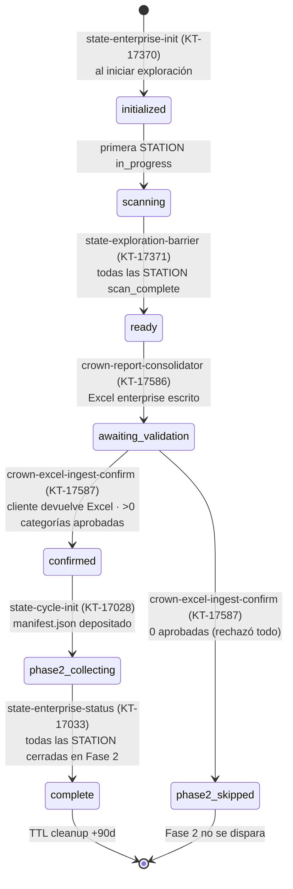

# State Machine — CYCLE, STATION, REQUEST

> **Actualizado:** 2026-06-30 — flujo de cierre de Fase 1 por **Excel manual** (sin front) + estados `ready` / `awaiting_validation`.
> Fuente de verdad de estados: spec [KT-17371](https://kriptosteam.atlassian.net/browse/KT-17371) (`specs-staging/KT-17371-state-exploration-barrier.md`).
> Store: DDB `classifier-cycles-state` (monorepo `classifier-state-backend`, KT-17271). PK `enterprise_id`, SK `CYCLE# · STATION# · REQUEST#`, Stream `NEW_AND_OLD_IMAGES`.

---

## CYCLE — transiciones de estado

El CYCLE trackea el avance de un enterprise completo a través de Fase 1 (exploración + validación por Excel) y Fase 2 (GSE).



### Campos por estado del CYCLE

| Estado | Campo | Valor | Quién lo setea |
|---|---|---|---|
| `initialized` | `status` | "initialized" | **state-enterprise-init** (KT-17370) |
| | `stations_expected` | N (de KEM) | state-enterprise-init |
| | `area_id` | (si viene en payload) | state-enterprise-init |
| `scanning` | `status` | "scanning" | state-exploration-barrier (primera STATION `in_progress`) |
| | `stations_scan_complete` | 0 → N | state-exploration-barrier (incrementa) |
| `ready` | `status` | "ready" | **state-exploration-barrier** (KT-17371, barrier) |
| | `stations_scan_complete` | = stations_expected | state-exploration-barrier |
| `awaiting_validation` | `status` | "awaiting_validation" | **crown-report-consolidator** (KT-17586) |
| | `report_s3_uri` | `s3://…/crown-reports-pending/{ent}/{cycle}/assessment.xlsx` | crown-report-consolidator |
| `confirmed` | `status` | "confirmed" | **crown-excel-ingest-confirm** (KT-17587) |
| | `confirmed_at` | now() | crown-excel-ingest-confirm |
| | `approved_categories` / `total_files` | N | crown-excel-ingest-confirm |
| `phase2_skipped` | `status` | "phase2_skipped" | crown-excel-ingest-confirm (0 aprobadas) |
| `phase2_collecting` | `status` | "phase2_collecting" | **state-cycle-init** (KT-17028) |
| `complete` | `status` | "complete" | **state-enterprise-status** (KT-17033) |
| | `completed_at` / `ttl` | now() / now()+90d | state-enterprise-status |

> **Nota:** `ready` reemplaza al antiguo `stations_complete`. `awaiting_validation` es un estado propio (no sub-estado de `ready`) porque la espera del cliente puede durar **semanas** — Banco de Chile opera con ciclo trimestral de revisión JDC (KAIM-6315).

---

## STATION — transiciones de estado

Cada STATION trackea el avance de un par enterprise+station a través de ambas fases.

```
Fase 1 (exploración + scan&match):
  requested                         ← state-enterprise-init (KT-17370) crea la STATION
    ↓ (notificación de recorrido del agente)
  scan_status: in_progress          ← state-exploration-barrier (KT-17371)
    ↓ (EMR joyas-priorizer entrega crown_jewels.json + rollup.json de la estación)
  scan_status: scan_complete        ← state-exploration-barrier (KT-17371)
  joyas_count: N

Fase 2 (GSE):
  sampling_status: requested        ← state-cycle-init (KT-17028)
    ↓ (gse-sample-reception-notifier en la 1ra muestra)
  sampling_status: uploading
    ↓ (todas las muestras recibidas)
  sampling_status: sample_collected
    ↓ (gse-sample-anonymizer-notifier cuando todas anonimizadas)
  sampling_status: sample_anonymized
    ↓ (state-station-status cierra la STATION)
  status: complete
```

### Barrier de enterprise (Fase 1) — condición de `CYCLE → ready`

CYCLE pasa a `ready` cuando: `count(STATION.scan_status == "scan_complete") >= stations_expected`.

Dispatcher: **state-exploration-barrier** (KT-17371) — Lambda sobre DDB Stream (filter `STATION#` + Fase 1) y/o EventBridge del `rollup.json` del EMR. Conditional `SET status="ready" IF status="scanning" AND stations_scan_complete >= stations_expected`.

### Barrier de STATION (Fase 2) — condición de cierre

STATION cierra cuando: `(samples_anonymized + samples_skipped) >= samples_expected`.
Dispatcher: **state-station-status** (KT-17032) — Lambda sobre DDB Stream (filter `STATION#` + Fase 2).

---

## REQUEST — transiciones de estado (Fase 2)

Cada REQUEST trackea el muestreo de un tipo de request específico (ej. "pii", "financial").

```
requested                ← state-cycle-init crea un REQUEST por STATION
  ↓ (gse-request-complete cuando el agente termina de subir)
sent
```

| Estado | Campo | Valor | Quién lo setea |
|---|---|---|---|
| `requested` | `status` / `samples_expected` | "requested" / len(files_to_sample) | state-cycle-init (KT-17028) |
| `sent` | `status` / `total_samples_uploaded` / `samples_skipped` / `sent_at` | "sent" / N / N / now() | gse-request-complete (KT-17031) |

---

## Triggers de transición por Lambda

| Lambda | Trigger | Transición | Nuevo estado |
|---|---|---|---|
| **state-enterprise-init** (KT-17370) | Inicio de exploración (agente) | Crea ENTERPRISE + CYCLE + STATIONs | CYCLE `initialized` |
| **state-exploration-barrier** (KT-17371) | Notificación de recorrido (SQS) | STATION `scan_status = in_progress` | CYCLE `scanning` |
| **state-exploration-barrier** (KT-17371) | EMR result (`rollup.json` PutObject) | STATION `scan_complete` + `joyas_count`; barrier | CYCLE `ready` |
| **crown-report-consolidator** (KT-17586) | DDB Stream CYCLE `status=ready` | Suma rollups → escribe Excel enterprise | CYCLE `awaiting_validation` |
| **crown-excel-ingest-confirm** (KT-17587) | S3 PutObject `crown-reports-validated/…/assessment.xlsx` | Parsea Excel, escribe manifest + station files | CYCLE `confirmed` / `phase2_skipped` |
| **state-cycle-init** (KT-17028) | S3 PutObject `validated_crown_jewels/{ent}/{cycle}/manifest.json` | Crea STATIONs Fase 2 | CYCLE `phase2_collecting` |
| **gse-sample-reception-notifier** (KT-17029) | S3 PutObject `gse-raw/…/sample.json` | STATION `uploading`, `samples_received++` | (counter) |
| **gse-sample-anonymizer-notifier** (KT-17030) | S3 PutObject `gse-anonymized/…/sample.json` | `samples_anonymized++` | (check barrier) |
| **gse-request-complete** (KT-17031) | API GW / agente | REQUEST `sent` | REQUEST `sent` |
| **state-station-status** (KT-17032) | DDB Stream STATION + barrier Fase 2 | Incrementa CYCLE `stations_completed` | STATION `complete` |
| **state-enterprise-status** (KT-17033) | DDB Stream CYCLE + todas las STATION cerradas | Notifica LLM, setea TTL | CYCLE `complete` |

---

## Idempotencia & exactly-once

Cada transición usa **conditional writes** para garantizar exactly-once:

- **state-exploration-barrier:** notificación idempotente por `(station_id, event_type)`; status STATION monotónico (no retrocede de `scan_complete`); barrier `SET status="ready" IF status="scanning" AND stations_scan_complete >= stations_expected`.
- **crown-report-consolidator:** reescribe el mismo objeto S3 por cycle; transición condicional `IF status="ready"`.
- **crown-excel-ingest-confirm:** `IF status="awaiting_validation"`; re-depósito del mismo Excel no duplica el trigger de Fase 2.
- **state-enterprise-status:** `SET status="complete" IF status="phase2_collecting"`.

---

## Monitoreo & debugging

```sql
-- CYCLE colgado en "scanning" (alguna STATION no reportó scan_complete)
SELECT * FROM classifier-cycles-state
WHERE pk = "ent-001" AND sk begins_with "CYCLE#"
AND #status = "scanning" AND created_at < now() - 1 hour

-- CYCLE en "awaiting_validation" (esperando al cliente — puede ser normal por semanas)
SELECT * FROM classifier-cycles-state
WHERE pk = "ent-001" AND sk begins_with "CYCLE#"
AND #status = "awaiting_validation"

-- STATION que no reportó scan_complete
SELECT * FROM classifier-cycles-state
WHERE pk = "ent-001" AND sk begins_with "STATION#"
AND scan_status <> "scan_complete"
```

> **OQ abiertas (KT-17371):** canal exacto de la notificación de recorrido (Equipo Agente) y reaper de CYCLEs colgados en `awaiting_validation` (Producto, sin reaper en MVP).
